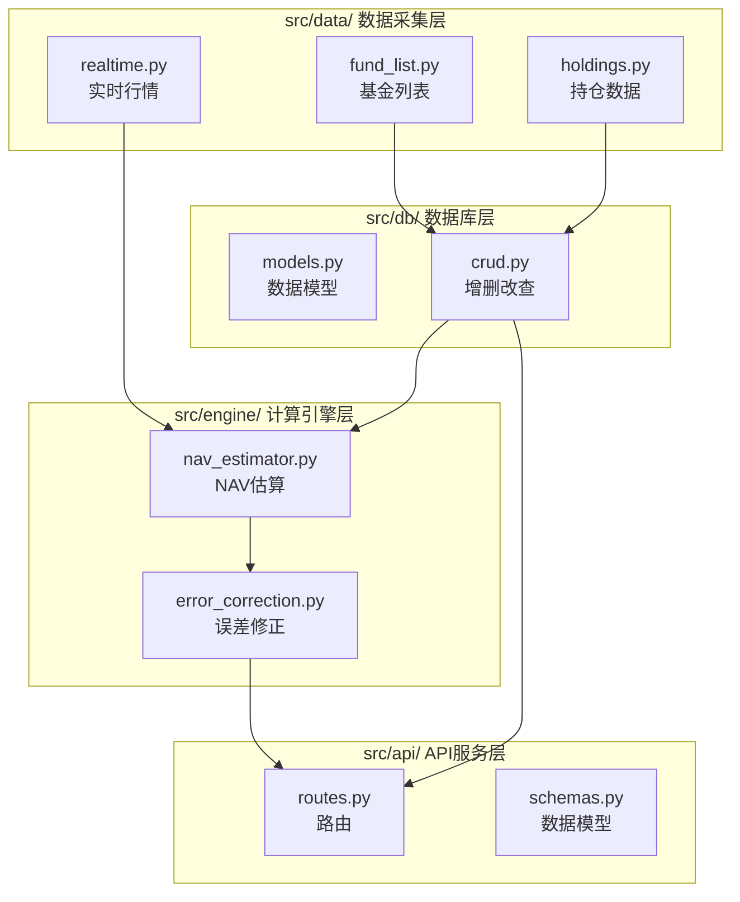

# 系统架构文档 (@architecture.md)

> [!IMPORTANT]
> **此文档为强制阅读文档！写任何代码前必须完整阅读！**

---

## 模块架构



---

## 数据库结构 (SQLite)

### 表结构

#### 1. funds - 基金基础信息

```sql
CREATE TABLE funds (
    fund_code TEXT PRIMARY KEY,      -- 基金代码 (如: 000001)
    fund_name TEXT NOT NULL,         -- 基金名称
    fund_type TEXT,                  -- 基金类型 (股票型/混合型)
    latest_nav REAL,                 -- 最新净值
    nav_date DATE,                   -- 净值日期
    created_at TIMESTAMP DEFAULT CURRENT_TIMESTAMP,
    updated_at TIMESTAMP DEFAULT CURRENT_TIMESTAMP
);
```

#### 2. holdings - 基金持仓

```sql
CREATE TABLE holdings (
    id INTEGER PRIMARY KEY AUTOINCREMENT,
    fund_code TEXT NOT NULL,         -- 基金代码
    stock_code TEXT NOT NULL,        -- 股票代码
    stock_name TEXT,                 -- 股票名称
    weight REAL NOT NULL,            -- 持仓占比 (%)
    report_date DATE NOT NULL,       -- 报告期 (季报日期)
    created_at TIMESTAMP DEFAULT CURRENT_TIMESTAMP,
    FOREIGN KEY (fund_code) REFERENCES funds(fund_code),
    UNIQUE(fund_code, stock_code, report_date)
);
```

#### 3. nav_history - 历史净值

```sql
CREATE TABLE nav_history (
    id INTEGER PRIMARY KEY AUTOINCREMENT,
    fund_code TEXT NOT NULL,         -- 基金代码
    nav_date DATE NOT NULL,          -- 净值日期
    nav REAL NOT NULL,               -- 单位净值
    acc_nav REAL,                    -- 累计净值
    daily_return REAL,               -- 日涨跌幅 (%)
    created_at TIMESTAMP DEFAULT CURRENT_TIMESTAMP,
    FOREIGN KEY (fund_code) REFERENCES funds(fund_code),
    UNIQUE(fund_code, nav_date)
);
```

#### 4. nav_estimates - 估算记录

```sql
CREATE TABLE nav_estimates (
    id INTEGER PRIMARY KEY AUTOINCREMENT,
    fund_code TEXT NOT NULL,         -- 基金代码
    estimate_time TIMESTAMP NOT NULL, -- 估算时间
    estimated_nav REAL NOT NULL,     -- 估算净值
    estimated_return REAL,           -- 估算涨跌幅 (%)
    actual_nav REAL,                 -- 实际净值 (收盘后填入)
    error_rate REAL,                 -- 误差率 (%)
    created_at TIMESTAMP DEFAULT CURRENT_TIMESTAMP,
    FOREIGN KEY (fund_code) REFERENCES funds(fund_code)
);
```

#### 5. user_watchlist - 用户关注列表

```sql
CREATE TABLE user_watchlist (
    id INTEGER PRIMARY KEY AUTOINCREMENT,
    fund_code TEXT NOT NULL UNIQUE,  -- 基金代码
    fund_name TEXT,                  -- 基金名称
    added_at TIMESTAMP DEFAULT CURRENT_TIMESTAMP
);
```

---

## 模块职责

| 模块 | 文件 | 职责 | 最大行数 |
|------|------|------|----------|
| `data/` | `fund_list.py` | 从 AKShare 获取基金列表 | 200 |
| `data/` | `holdings.py` | 获取基金季报持仓数据 | 200 |
| `data/` | `realtime.py` | 获取股票实时行情 | 200 |
| `engine/` | `nav_estimator.py` | NAV 估算核心算法 | 200 |
| `engine/` | `error_correction.py` | 基于历史误差的修正 | 150 |
| `db/` | `models.py` | SQLAlchemy 或原生 SQL 模型 | 150 |
| `db/` | `crud.py` | 数据库增删改查封装 | 200 |
| `api/` | `routes.py` | FastAPI 路由定义 | 150 |
| `api/` | `schemas.py` | Pydantic 请求/响应模型 | 100 |

---

## 禁止事项

> [!CAUTION]
> 以下做法**严格禁止**：

1. ❌ 单个文件超过 200 行
2. ❌ 把所有代码写在 `main.py`
3. ❌ 数据库操作散落在各模块
4. ❌ 重复的代码逻辑
5. ❌ 不写 `__init__.py` 的模块
6. ❌ 硬编码配置值（应放入 `config.py`）

---

## 文件说明

### 根目录文件

| 文件 | 用途 |
|------|------|
| `config.py` | **集中配置管理** - 所有常量（数据库路径、API 端口、更新间隔等）必须在此定义 |
| `main.py` | **程序入口** - 初始化数据库、注册路由、配置定时任务、启动服务 |
| `requirements.txt` | 依赖清单 |

### src/ 模块结构

| 路径 | 用途 | 依赖关系 |
|------|------|----------|
| `src/data/fund_list.py` | 从 AKShare 获取基金列表和信息 | → `src/db/crud.py` |
| `src/data/holdings.py` | 获取基金季报持仓数据 | → `src/db/crud.py` |
| `src/data/realtime.py` | 获取股票实时行情（含缓存） | 无 |
| `src/engine/nav_estimator.py` | NAV 估算核心算法 | → `src/data/realtime.py`, `src/db/crud.py` |
| `src/engine/error_correction.py` | EWA 误差修正算法 | → `src/db/crud.py` |
| `src/db/models.py` | 数据库表结构定义和初始化 | ← `config.py` |
| `src/db/crud.py` | 数据库 CRUD 操作封装 | ← `src/db/models.py` |
| `src/api/schemas.py` | Pydantic 请求/响应模型 | 无 |
| `src/api/routes.py` | FastAPI 路由定义 | → `src/db/crud.py`, `src/engine/*` |
| `src/utils/helpers.py` | 通用辅助函数 | 无 |

### 其他目录

| 路径 | 用途 |
|------|------|
| `frontend/` | 简单 Web 前端（HTML + JS + CSS） |
| `data/` | SQLite 数据库文件存放目录（`fundbug.db`） |
| `tests/` | 测试文件目录 |
| `memory-bank/` | 设计文档和开发记录 |

### 数据流向

```
用户请求 → API (routes.py)
              ↓
         数据库查询 (crud.py)
              ↓
         计算引擎 (nav_estimator.py)
              ↓
         实时行情 (realtime.py → AKShare)
              ↓
         误差修正 (error_correction.py)
              ↓
         返回结果 → 前端渲染
```

