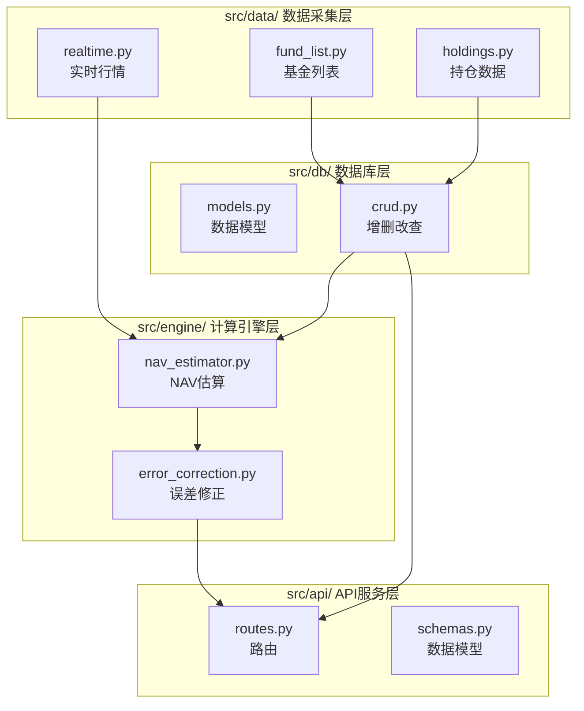

# 系统架构文档 (architecture.md)

> [!IMPORTANT]
> **此文档为强制阅读文档！写任何代码前必须完整阅读！**

---

## 模块架构



---

## 数据库结构 (SQLite)

### 表结构

#### 1. funds - 基金基础信息

```sql
CREATE TABLE funds (
    fund_code TEXT PRIMARY KEY,      -- 基金代码 (如: 000001)
    fund_name TEXT NOT NULL,         -- 基金名称
    fund_type TEXT,                  -- 基金类型 (股票型/混合型)
    latest_nav REAL,                 -- 最新净值
    nav_date DATE,                   -- 净值日期
    created_at TIMESTAMP DEFAULT CURRENT_TIMESTAMP,
    updated_at TIMESTAMP DEFAULT CURRENT_TIMESTAMP
);
```

#### 2. holdings - 基金持仓

```sql
CREATE TABLE holdings (
    id INTEGER PRIMARY KEY AUTOINCREMENT,
    fund_code TEXT NOT NULL,         -- 基金代码
    stock_code TEXT NOT NULL,        -- 股票代码
    stock_name TEXT,                 -- 股票名称
    weight REAL NOT NULL,            -- 持仓占比 (%)
    report_date DATE NOT NULL,       -- 报告期 (季报日期)
    created_at TIMESTAMP DEFAULT CURRENT_TIMESTAMP,
    FOREIGN KEY (fund_code) REFERENCES funds(fund_code),
    UNIQUE(fund_code, stock_code, report_date)
);
```

#### 3. nav_history - 历史净值

```sql
CREATE TABLE nav_history (
    id INTEGER PRIMARY KEY AUTOINCREMENT,
    fund_code TEXT NOT NULL,         -- 基金代码
    nav_date DATE NOT NULL,          -- 净值日期
    nav REAL NOT NULL,               -- 单位净值
    acc_nav REAL,                    -- 累计净值
    daily_return REAL,               -- 日涨跌幅 (%)
    created_at TIMESTAMP DEFAULT CURRENT_TIMESTAMP,
    FOREIGN KEY (fund_code) REFERENCES funds(fund_code),
    UNIQUE(fund_code, nav_date)
);
```

#### 4. nav_estimates - 估算记录

```sql
CREATE TABLE nav_estimates (
    id INTEGER PRIMARY KEY AUTOINCREMENT,
    fund_code TEXT NOT NULL,         -- 基金代码
    estimate_time TIMESTAMP NOT NULL, -- 估算时间
    estimated_nav REAL NOT NULL,     -- 估算净值
    estimated_return REAL,           -- 估算涨跌幅 (%)
    actual_nav REAL,                 -- 实际净值 (收盘后填入)
    error_rate REAL,                 -- 误差率 (%)
    created_at TIMESTAMP DEFAULT CURRENT_TIMESTAMP,
    FOREIGN KEY (fund_code) REFERENCES funds(fund_code)
);
```

#### 5. user_watchlist - 用户关注列表

```sql
CREATE TABLE user_watchlist (
    id INTEGER PRIMARY KEY AUTOINCREMENT,
    fund_code TEXT NOT NULL UNIQUE,  -- 基金代码
    fund_name TEXT,                  -- 基金名称
    added_at TIMESTAMP DEFAULT CURRENT_TIMESTAMP
);
```

---

## 模块职责

| 模块 | 文件 | 职责 | 最大行数 |
|------|------|------|----------|
| `data/` | `fund_list.py` | 从 AKShare 获取基金列表 | 200 |
| `data/` | `holdings.py` | 获取基金季报持仓数据 | 200 |
| `data/` | `realtime.py` | 获取股票实时行情 | 200 |
| `engine/` | `nav_estimator.py` | NAV 估算核心算法 | 200 |
| `engine/` | `error_correction.py` | 基于历史误差的修正 | 150 |
| `db/` | `models.py` | SQLAlchemy 或原生 SQL 模型 | 150 |
| `db/` | `crud.py` | 数据库增删改查封装 | 200 |
| `api/` | `routes.py` | FastAPI 路由定义 | 150 |
| `api/` | `schemas.py` | Pydantic 请求/响应模型 | 100 |

---

## 禁止事项

> [!CAUTION]
> 以下做法**严格禁止**：

1. ❌ 单个文件超过 200 行
2. ❌ 把所有代码写在 `main.py`
3. ❌ 数据库操作散落在各模块
4. ❌ 重复的代码逻辑
5. ❌ 不写 `__init__.py` 的模块
6. ❌ 硬编码配置值（应放入 `config.py`）

---

## 文件说明

### 根目录文件

| 文件 | 用途 |
|------|------|
| `config.py` | **集中配置管理（全局唯一配置源）** — 管理 8 个配置项：数据库路径（`DATABASE_PATH`）、API 服务（`API_HOST`/`API_PORT`）、交易时间窗口（`TRADING_START`/`TRADING_END`）、更新频率（`UPDATE_INTERVAL_SECONDS=60s`）、数据保留策略（`DATA_RETENTION_DAYS=7`）、误差修正参数（`EWA_ALPHA=0.3`）。所有模块必须从此导入，禁止硬编码 |
| `main.py` | **程序入口** — 初始化数据库、注册路由、配置定时任务、启动 uvicorn 服务 |
| `requirements.txt` | **依赖清单** — 9 个直接依赖，按功能分组（API/数据/计算/任务/前端/测试） |
| `.gitignore` | **Git 忽略规则** — 排除 `.venv/`、`__pycache__/`、`.db` 文件、IDE 配置等 |
| `CLAUDE.md` | **AI 开发者指令** — 项目级编码规范、架构约束、认知架构（AI 辅助开发时自动读取） |

### 环境目录

| 路径 | 用途 | 备注 |
|------|------|------|
| `.venv/` | **Python 虚拟环境** — 隔离项目依赖，避免污染全局环境 | 已加入 `.gitignore`，不提交 |

### src/ 模块结构

| 路径 | 用途 | 依赖关系 |
|------|------|----------|
| `src/__init__.py` | 包标识文件 | 无 |
| `src/data/fund_list.py` | 从 AKShare 获取基金列表和信息 (组合查询+重试) | → `src/db/crud.py`, `src/utils/helpers.py` |
| `src/data/holdings.py` | 获取基金季报持仓数据 | → `src/db/crud.py` |
| `src/data/realtime.py` | 获取股票实时行情（含缓存） | 无 |
| `src/engine/nav_estimator.py` | NAV 估算核心算法 | → `src/data/realtime.py`, `src/db/crud.py` |
| `src/engine/error_correction.py` | EWA 误差修正算法 | → `src/db/crud.py` |
| `src/db/models.py` | **数据库表结构定义和初始化**（106 行）— 定义 5 张表的 `CREATE TABLE` SQL，导出 `init_db(db_path)` 建表函数和 `get_connection(db_path)` 连接函数。启用 `PRAGMA foreign_keys = ON` + `sqlite3.Row` factory | ← `config.DATABASE_PATH` |
| `src/db/crud.py` | 数据库 CRUD 操作封装 | ← `src/db/models.py` |
| `src/api/schemas.py` | Pydantic 请求/响应模型 | 无 |
| `src/api/routes.py` | FastAPI 路由定义 | → `src/db/crud.py`, `src/engine/*` |
| `src/utils/helpers.py` | 通用辅助函数（如 retry_on_failure） | 无 |

### 其他目录

| 路径 | 用途 |
|------|------|
| `frontend/` | 简单 Web 前端（HTML + JS + CSS） |
| `data/` | SQLite 数据库文件存放目录（`fundbug.db`），已在 `.gitignore` 中排除 `.db` 文件 |
| `tests/` | 测试文件目录 |
| `memory-bank/` | 设计文档和开发记录（`progress.md` / `architecture.md` / `implementation-plan.md` 等） |
| `prompts/` | AI 提示词模板存档 |

### 数据流向

```
用户请求 → API (routes.py)
              ↓
         数据库查询 (crud.py)
              ↓
         计算引擎 (nav_estimator.py)
              ↓
         实时行情 (realtime.py → AKShare)
              ↓
         误差修正 (error_correction.py)
              ↓
         返回结果 → 前端渲染
```

---

---

## 测试架构

> 采用 `pytest` + `unittest.mock` 进行单元测试和集成测试。

### 核心机制

1. **数据库隔离**：
    - 为了避免测试污染开发环境数据库 (`data/fundbug.db`)，测试使用 **临时文件数据库** (`tempfile.mkstemp`)。
    - **Dependency Injection**: 通过 `tests/conftest.py` 中的 `mock_db_connection` fixture，使用 `unittest.mock.patch` 自动拦截 `src.db.crud` 中的 `get_connection` 调用，将其重定向到临时数据库。
    - 这种方式允许 `crud.py` 代码保持原样（导入生产环境配置），但在测试运行时自动切换上下文。

2. **Fixture 管理**：
    - `test_db_path`: 创建并初始化临时数据库 schema，测试结束后自动清理文件。
    - `mock_db_connection`: `autouse=True`，自动应用于所有测试，无需手动装饰。

---

## 依赖架构

> 每个依赖在系统中扮演明确角色，禁止引入职责重叠的替代库。

```
┌─────────────────────────────────────────────────────────┐
│                    应用层 (Application)                   │
│  fastapi + uvicorn ──── API 服务与 ASGI 运行时           │
│  jinja2 ─────────────── 前端 HTML 模板渲染               │
│  python-multipart ───── 表单数据解析                     │
├─────────────────────────────────────────────────────────┤
│                    业务层 (Business Logic)                │
│  pandas + numpy ─────── 持仓加权计算、EWA 误差修正       │
│  apscheduler ────────── 盘中定时估算 (每60秒) + 数据清理  │
├─────────────────────────────────────────────────────────┤
│                    数据层 (Data Access)                   │
│  akshare ────────────── A 股实时行情 + 基金持仓数据源     │
│  sqlite3 (内置) ─────── 本地持久化存储                    │
├─────────────────────────────────────────────────────────┤
│                    开发层 (Development)                   │
│  pytest ─────────────── 单元测试与集成测试               │
└─────────────────────────────────────────────────────────┘
```

### 依赖间关系

| 依赖 | 被哪些模块使用 | 备注 |
|------|----------------|------|
| `fastapi` | `src/api/routes.py`, `main.py` | 路由定义、请求校验、API 文档生成 |
| `uvicorn` | `main.py` | 仅在入口文件启动 ASGI 服务 |
| `akshare` | `src/data/*.py` | 仅限数据采集层调用，禁止其他层直接依赖 |
| `pandas` | `src/data/*.py`, `src/engine/*.py` | 数据清洗与计算 |
| `numpy` | `src/engine/*.py` | EWA 等数值计算 |
| `apscheduler` | `main.py` | 仅在入口文件配置定时任务 |
| `jinja2` | `main.py` (模板配置) | FastAPI 模板引擎 |
| `sqlite3` | `src/db/*.py` | Python 内置，无需安装 |

