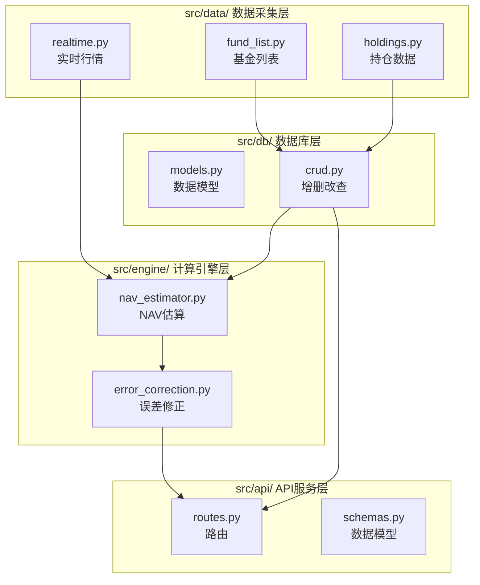

# 系统架构文档 (architecture.md)

> [!IMPORTANT]
> **此文档为强制阅读文档！写任何代码前必须完整阅读！**

---

## 模块架构



---

## 数据库结构 (SQLite)

### 表结构

#### 1. funds - 基金基础信息

```sql
CREATE TABLE funds (
    fund_code TEXT PRIMARY KEY,      -- 基金代码 (如: 000001)
    fund_name TEXT NOT NULL,         -- 基金名称
    fund_type TEXT,                  -- 基金类型 (股票型/混合型)
    latest_nav REAL,                 -- 最新净值
    nav_date DATE,                   -- 净值日期
    created_at TIMESTAMP DEFAULT CURRENT_TIMESTAMP,
    updated_at TIMESTAMP DEFAULT CURRENT_TIMESTAMP
);
```

#### 2. holdings - 基金持仓

```sql
CREATE TABLE holdings (
    id INTEGER PRIMARY KEY AUTOINCREMENT,
    fund_code TEXT NOT NULL,         -- 基金代码
    stock_code TEXT NOT NULL,        -- 股票代码
    stock_name TEXT,                 -- 股票名称
    weight REAL NOT NULL,            -- 持仓占比 (%)
    report_date DATE NOT NULL,       -- 报告期 (季报日期)
    created_at TIMESTAMP DEFAULT CURRENT_TIMESTAMP,
    FOREIGN KEY (fund_code) REFERENCES funds(fund_code),
    UNIQUE(fund_code, stock_code, report_date)
);
```

#### 3. nav_history - 历史净值

```sql
CREATE TABLE nav_history (
    id INTEGER PRIMARY KEY AUTOINCREMENT,
    fund_code TEXT NOT NULL,         -- 基金代码
    nav_date DATE NOT NULL,          -- 净值日期
    nav REAL NOT NULL,               -- 单位净值
    acc_nav REAL,                    -- 累计净值
    daily_return REAL,               -- 日涨跌幅 (%)
    created_at TIMESTAMP DEFAULT CURRENT_TIMESTAMP,
    FOREIGN KEY (fund_code) REFERENCES funds(fund_code),
    UNIQUE(fund_code, nav_date)
);
```

#### 4. nav_estimates - 估算记录

```sql
CREATE TABLE nav_estimates (
    id INTEGER PRIMARY KEY AUTOINCREMENT,
    fund_code TEXT NOT NULL,         -- 基金代码
    estimate_time TIMESTAMP NOT NULL, -- 估算时间
    estimated_nav REAL NOT NULL,     -- 估算净值
    estimated_return REAL,           -- 估算涨跌幅 (%)
    actual_nav REAL,                 -- 实际净值 (收盘后填入)
    error_rate REAL,                 -- 误差率 (%)
    created_at TIMESTAMP DEFAULT CURRENT_TIMESTAMP,
    FOREIGN KEY (fund_code) REFERENCES funds(fund_code)
);
```

#### 5. user_watchlist - 用户关注列表

```sql
CREATE TABLE user_watchlist (
    id INTEGER PRIMARY KEY AUTOINCREMENT,
    fund_code TEXT NOT NULL UNIQUE,  -- 基金代码
    fund_name TEXT,                  -- 基金名称
    added_at TIMESTAMP DEFAULT CURRENT_TIMESTAMP
);
```

---

## 模块职责

| 模块 | 文件 | 职责 | 最大行数 |
|------|------|------|----------|
| `data/` | `fund_list.py` | 从 AKShare 获取基金列表 | 200 |
| `data/` | `holdings.py` | 获取基金季报持仓数据（自动解析最新季度，未披露部分视为现金） | 200 |
| `data/` | `realtime.py` | **异步实时行情服务** (单例) — 维护后台循环每 1s 拉取全市场行情。使用 `ThreadPoolExecutor` 隔离阻塞 I/O，提供 O(1) 内存缓存读取。 | 300 |
| `engine/` | `nav_estimator.py` | **NAV 估算核心算法** — 从 `AsyncRealtimeProvider` 读取内存缓存进行零 I/O 估算。支持批量估算。 | 200 |
| `engine/` | `error_correction.py` | **EWA 误差修正模块** — 基于历史误差修正估算结果。公式：`EWA_t = α×error_t + (1-α)×EWA_{t-1}`。 | 150 |
| `db/` | `models.py` | **数据库模型** — 定义表结构，导出 `init_db` 和 `get_connection`。 | 150 |
| `db/` | `crud.py` | **CRUD 外观模式** — 统一导出子模块函数。 | 100 |
| `db/` | `crud_*.py` | **CRUD 实现** — funds/holdings/nav/watchlist 具体实现。 | 150 |
| `api/` | `routes.py` | **FastAPI 路由** — 定义 API 端点。 | 200 |
| `api/` | `schemas.py` | **Pydantic 模型** — 请求/响应数据定义。 | 150 |

---

## 禁止事项

> [!CAUTION]
> 以下做法**严格禁止**：

1. ❌ 单个文件超过 200 行
2. ❌ 把所有代码写在 `main.py`
3. ❌ 数据库操作散落在各模块
4. ❌ 重复的代码逻辑
5. ❌ 不写 `__init__.py` 的模块
6. ❌ 硬编码配置值（应放入 `config.py`）

---

## 文件说明

### 根目录文件

| 文件 | 用途 |
|------|------|
| `config.py` | **集中配置管理（全局唯一配置源）** — 管理 8 个配置项：数据库路径（`DATABASE_PATH`）、API 服务（`API_HOST`/`API_PORT`）、交易时间窗口（`TRADING_START`/`TRADING_END`）、更新频率（`UPDATE_INTERVAL_SECONDS=60s`）、数据保留策略（`DATA_RETENTION_DAYS=7`）、误差修正参数（`EWA_ALPHA=0.3`）。所有模块必须从此导入，禁止硬编码 |
| `main.py` | **程序入口** — 初始化数据库 (`init_db`)、注册路由、配置并启动 **4 个核心定时任务**（持仓更新、盘中估算、净值回填、数据清理）、启动 uvicorn 服务 |
| `requirements.txt` | **依赖清单** — 9 个直接依赖，按功能分组（API/数据/计算/任务/前端/测试） |
| `.gitignore` | **Git 忽略规则** — 排除 `.venv/`、`__pycache__/`、`.db` 文件、IDE 配置等 |
| `CLAUDE.md` | **AI 开发者指令** — 项目级编码规范、架构约束、认知架构（AI 辅助开发时自动读取） |
| `run_tests.sh` | **测试运行脚本** — 一键运行全量 pytest 测试，自动设置环境变量 |

### 环境目录

| 路径 | 用途 | 备注 |
|------|------|------|
| `.venv/` | **Python 虚拟环境** — 隔离项目依赖，避免污染全局环境 | 已加入 `.gitignore`，不提交 |

### src/ 模块结构

| 路径 | 用途 | 依赖关系 |
|------|------|----------|
| `src/__init__.py` | 包标识文件 | 无 |
| `src/data/fund_list.py` | 从 AKShare 获取基金列表和信息 (组合查询+重试) | → `src/db/crud.py`, `src/utils/helpers.py` |
| `src/data/holdings.py` | 获取基金季报持仓数据 | → `src/db/crud.py` |
| `src/data/realtime.py` | 获取股票实时行情（含缓存） | 无 |
| `src/engine/nav_estimator.py` | **NAV 估算核心算法**（146 行）— 导出 `estimate_fund_nav(fund_code)` 单基金估算、`estimate_all_watchlist()` 批量估算。内部 `_calculate_weighted_return` 纯函数计算加权涨跌幅和现金比例。公式：`预估净值 = 前一日净值 × (1 + 加权涨跌幅/100)`，未披露持仓视为现金 | → `src/data/realtime.py`, `src/db/crud.py` |
| `src/engine/error_correction.py` | **EWA 误差修正模块**（103 行）— 导出 `calculate_ewa_bias(fund_code)` 计算历史误差的指数加权平均偏差、`apply_correction(nav, bias)` 纯函数修正净值、`correct_fund_estimate(fund_code, nav, return)` 完整修正流程、`update_actual_and_errors(fund_code, actual_nav, date)` 收盘后回填实际净值。公式：`EWA_t = α×error_t + (1-α)×EWA_{t-1}`，`α=0.3` | → `src/db/crud.py`, ← `config.EWA_ALPHA` |
| `src/db/models.py` | **数据库表结构定义和初始化**（106 行）— 定义 5 张表的 `CREATE TABLE` SQL，导出 `init_db(db_path)` 建表函数和 `get_connection(db_path)` 连接函数。启用 `PRAGMA foreign_keys = ON` + `sqlite3.Row` factory | ← `config.DATABASE_PATH` |
| `src/db/crud.py` | **CRUD 外观层** — 自身不含逻辑，仅导入并重新导出 `crud_*.py` 中的函数，保持对外接口不变。 | ← `src/db/models.py`, `src/db/crud_*.py` |
| `src/db/crud_*.py` | **CRUD 实现层** — 拆分为 funds/holdings/nav/watchlist 4 个子模块。 | ← `src/db/models.py` |
| `src/api/schemas.py` | **Pydantic 数据模型**（88 行）— 定义 6 个 API 交互模型：`AddFundRequest` (含 6 位代码校验), `FundInfo`, `FundHolding`, `NAVEstimate` (整合估算与修正数据), `NAVHistory`, `WatchlistItem`。自带 Mock 示例数据。 | 无 |
| `src/api/routes.py` | **FastAPI 路由定义**（109 行）— 实现 8 个端点，涵盖关注列表增删改查、基金持仓、历史净值及集成了误差修正的实时估算。在添加关注时支持同步触发数据采集。 | → `src/db/crud.py`, `src/engine/*`, `src/data/*` |
| `src/utils/helpers.py` | 通用辅助函数（如 retry_on_failure） | 无 |

### 其他目录

| 路径 | 用途 |
|------|------|
| `frontend/index.html` | **Web 主入口** — 采用 HTML5 语义化标签构建，提供基金管理接口和实时数据展示容器。 |
| `frontend/style.css` | **UI/UX 样式系统** — 实现暗色模式、响应式布局及组件样式（如：涨跌色、卡片布局）。 |
| `frontend/app.js` | **前端核心逻辑** — (Phase 6.2 待实现) 负责与 API 通信、定时刷新数据及 DOM 动态更新。 |

| `data/` | SQLite 数据库文件存放目录（`fundbug.db`），已在 `.gitignore` 中排除 `.db` 文件 |
| `tests/` | 测试文件目录 |
| `memory-bank/` | 设计文档和开发记录（`progress.md` / `architecture.md` / `implementation-plan.md` 等） |
| `prompts/` | AI 提示词模板存档 |

### 数据流向

```
用户请求 → API (routes.py)
              ↓
         数据库查询 (crud.py)
              ↓
         计算引擎 (nav_estimator.py)
              ↓
         实时行情 (realtime.py → AKShare)
              ↓
         误差修正 (error_correction.py)
              ↓
         返回结果 → 前端渲染
```

---

---

## 测试架构

> 采用 `pytest` + `unittest.mock` 进行单元测试和集成测试。

### 核心机制

1. **数据库隔离**：
    - 为了避免测试污染开发环境数据库 (`data/fundbug.db`)，测试使用 **临时文件数据库** (`tempfile.mkstemp`)。
    - **Dependency Injection**: 通过 `tests/conftest.py` 中的 `mock_db_connection` fixture，使用 `unittest.mock.patch` 拦截 `src.db.models.get_connection` (源头) 及所有 CRUD 子模块中的引用，将其重定向到临时数据库。
    - 这种方式确保无论代码如何导入 `get_connection`，测试环境都能彻底隔离。

2. **Fixture 管理**：
    - `test_db_path`: 创建并初始化临时数据库 schema，测试结束后自动清理文件。
    - `mock_db_connection`: `autouse=True`，自动应用于所有测试，无需手动装饰。

---

## 依赖架构

> 每个依赖在系统中扮演明确角色，禁止引入职责重叠的替代库。

```
┌─────────────────────────────────────────────────────────┐
│                    应用层 (Application)                   │
│  fastapi + uvicorn ──── API 服务与 ASGI 运行时           │
│  jinja2 ─────────────── 前端 HTML 模板渲染               │
│  python-multipart ───── 表单数据解析                     │
├─────────────────────────────────────────────────────────┤
│                    业务层 (Business Logic)                │
│  pandas + numpy ─────── 持仓加权计算、EWA 误差修正       │
│  apscheduler ────────── 盘中定时估算 (每60秒) + 数据清理  │
├─────────────────────────────────────────────────────────┤
│                    数据层 (Data Access)                   │
│  akshare ────────────── A 股实时行情 + 基金持仓数据源     │
│  sqlite3 (内置) ─────── 本地持久化存储                    │
├─────────────────────────────────────────────────────────┤
│                    开发层 (Development)                   │
│  pytest ─────────────── 单元测试与集成测试               │
└─────────────────────────────────────────────────────────┘
```

### 依赖间关系

| 依赖 | 被哪些模块使用 | 备注 |
|------|----------------|------|
| `fastapi` | `src/api/routes.py`, `main.py` | 路由定义、请求校验、API 文档生成 |
| `uvicorn` | `main.py` | 仅在入口文件启动 ASGI 服务 |
| `akshare` | `src/data/*.py` | 仅限数据采集层调用，禁止其他层直接依赖 |
| `pandas` | `src/data/*.py`, `src/engine/*.py` | 数据清洗与计算 |
| `numpy` | `src/engine/*.py` | EWA 等数值计算 |
| `apscheduler` | `main.py` | 仅在入口文件配置定时任务 |
| `jinja2` | `main.py` (模板配置) | FastAPI 模板引擎 |
| `sqlite3` | `src/db/*.py` | Python 内置，无需安装 |

---

## 前端交互模式 (Interaction Patterns)

### 1. 异步轮询与状态锁定 (Polling & State Locking)
为了保证后台数据更新不干扰前台用户交互，引入了 **isConfirming 状态位**：
- **场景**：系统每 60 秒自动更新一次净值估算。
- **冲突**：如果更新触发时用户正在操作弹窗，DOM 变动可能导致弹窗关闭或重排。
- **方案**：在 `refreshEstimates` 开始前检查 `isConfirming` 标志。若为 `true`，则跳过本次刷新。

### 2. 乐观更新与回滚 (Optimistic UI)
删除基金时采用乐观更新：
- 点击删除确认后，立即将卡片设为半透明（`opacity: 0.5`）并禁用交互。
- 待后端接口成功响应后彻底移除 DOM。
- 若后端失败，通过保存的备份恢复卡片显示并提示错误。

### 3. 自定义组件替代原生 UI
- **规范**：禁止使用 `confirm()`、`alert()` 等阻塞主线程且易受 DOM 更新干扰的原生方法。
- **实现**：采用 HTML/CSS 模态框，通过 `display: flex/none` 手动控制可见性，并在模态框激活时锁定全局刷新。

### 4. 色彩语义分离 (Semantic Color System)
为了适应不同金融市场的习惯（中/美），架构上将颜色定义分为两层：
- **语义层**：`--up-color`, `--down-color` (表示涨跌)
- **状态层**：`--success`, `--danger` (表示成功/失败)
- **实现**：`style.css` 中定义映射关系，JS 逻辑只操作 `.up/.down` 类名，不直接操作颜色值。

---

## 准实时数据架构 (Real-time Data Architecture)

### 核心设计：Producer-Consumer 模式

```
┌─────────────────────────────────────────────────────────────┐
│                  AsyncRealtimeProvider (单例)                 │
│  ┌──────────────────────────────────────────────────────┐   │
│  │ _fetch_worker() 后台循环:                            │   │
│  │   1. asyncio.sleep(1s + jitter)                     │   │
│  │   2. 线程池执行: ak.stock_bid_ask_em(关注列表)      │   │
│  │   3. 解析 DataFrame → 更新 quote_cache              │   │
│  │   4. 熔断检测: 失败 ≥3 次 → 指数退避               │   │
│  └──────────────────────────────────────────────────────┘   │
│                                                              │
│  内存缓存结构 (threading.RLock 保护):                        │
│  quote_cache = {                                             │
│    "000001": {"current_price": 10.5, "change_percent": 1.2},│
│    "600519": {"current_price": 1800, "change_percent": -1.0}│
│  }                                                           │
└─────────────────────────────────────────────────────────────┘
                            ↓
┌─────────────────────────────────────────────────────────────┐
│         定时任务触发 (APScheduler - 每 3 秒)                 │
│  scheduled_intraday_estimation()                             │
│    ↓                                                         │
│  nav_estimator.estimate_all_watchlist()                      │
└─────────────────────────────────────────────────────────────┘
                            ↓
┌─────────────────────────────────────────────────────────────┐
│              单基金估算 (estimate_fund_nav)                  │
│  1. holdings = crud.get_latest_holdings(fund_code)           │
│  2. fund_info = crud.get_fund(fund_code)                     │
│  3. provider = AsyncRealtimeProvider.get_instance()          │
│  4. for holding in holdings:                                 │
│       cached = provider.get_cached_quote(stock_code)  # O(1) │
│  5. weighted_return = Σ(weight × change) / 100               │
│  6. estimated_nav = latest_nav × (1 + weighted_return / 100) │
└─────────────────────────────────────────────────────────────┘
```

### 关键架构决策

#### 1. 从全量拉取切换到关注列表模式

**背景**: 初始设计每秒拉取全市场 5000+ 股票，3-5 分钟内必被封 IP。

**解决方案**:
- 改为仅拉取用户关注基金的持仓股票（通常 20-50 只）
- 使用 `ak.stock_bid_ask_em` 逐个拉取，配合 `ThreadPoolExecutor` 并发（max_workers=10）
- 在 `main.py` 启动时从数据库注入关注列表到 `AsyncRealtimeProvider`

**权衡**:
- ✅ 避免 IP 封禁，系统可持续运行
- ✅ 降低网络带宽和内存占用
- ❌ 牺牲了"全市场数据"的能力（但实际业务不需要）

#### 2. Asyncio + Threading 混合架构

**问题**: AKShare 底层是同步的 `requests`，直接在 asyncio 中调用会阻塞事件循环。

**解决方案**:
```python
async def _fetch_worker(self):
    while self.is_running:
        await asyncio.sleep(1.0)  # 异步等待
        loop = asyncio.get_running_loop()
        df = await loop.run_in_executor(
            self.executor,           # ThreadPoolExecutor
            self._fetch_data_safe    # 同步函数 (调用 AKShare)
        )
```

**关键点**:
- `asyncio` 负责调度和定时
- `ThreadPoolExecutor` 负责执行阻塞 I/O
- 两者通过 `run_in_executor` 桥接

#### 3. 线程安全的缓存管理

**问题**: `quote_cache` 在后台线程更新，在主线程读取，存在竞态条件。

**解决方案**:
```python
class AsyncRealtimeProvider:
    def __init__(self):
        self._cache_lock = threading.RLock()  # 可重入锁
        self.quote_cache = {}

    def get_cached_quote(self, stock_code: str):
        with self._cache_lock:
            return self.quote_cache.get(stock_code)

    def _update_cache(self, df: pd.DataFrame):
        # ... 构建 new_cache
        with self._cache_lock:
            self.quote_cache = new_cache
            self.last_update_time = now
```

**为什么用 RLock**:
- 允许同一线程多次获取锁（可重入）
- 防止死锁（如果 `_update_cache` 内部调用其他需要锁的方法）

#### 4. 启动时序的微妙之处

**错误做法**:
```python
# ❌ 在 lifespan 中调用 provider.start()
async def lifespan(app: FastAPI):
    provider = AsyncRealtimeProvider.get_instance()
    provider.start()  # 内部调用 asyncio.get_running_loop()
```

**问题**: `lifespan` 是 async 函数，但在 uvicorn 启动时事件循环可能尚未完全就绪，导致 `RuntimeError: no running event loop`。

**正确做法**:
```python
# ✅ 直接在 lifespan 的 async context 中创建任务
async def lifespan(app: FastAPI):
    provider = AsyncRealtimeProvider.get_instance()
    loop = asyncio.get_running_loop()  # 此时 loop 已就绪
    provider._background_task = loop.create_task(
        provider._fetch_worker()
    )
    provider.is_running = True
```

#### 5. 缓存就绪检测

**问题**: `AsyncRealtimeProvider` 每 1 秒更新缓存，但 `scheduled_intraday_estimation` 每 3 秒读取缓存。如果缓存在前 5 分钟都是空的（首次拉取需要 2-3 秒），前几次估算会因为 `missing_count > 50%` 而返回错误数据。

**解决方案**:
```python
async def lifespan(app: FastAPI):
    # ... 启动 AsyncRealtimeProvider

    # 等待首次缓存就绪
    logger.info("Waiting for initial cache to be ready...")
    for attempt in range(30):  # 最多等待 30 秒
        if realtime_provider.quote_cache:
            logger.info(f"✓ Cache ready with {len(realtime_provider.quote_cache)} stocks")
            break
        await asyncio.sleep(1)
    else:
        logger.warning("⚠️ Cache not ready after 30s")

    # 启动调度器
    scheduler.start()
```

#### 6. 指数退避熔断器

**问题**: 当前熔断仅延长到 5 秒，无法应对 IP 封禁（通常需 30-60 分钟）。

**解决方案**:
```python
if self.consecutive_failures >= 3:
    # 5s -> 10s -> 20s -> 40s -> ... -> 最多 5 分钟
    backoff = min(300, 5 * (2 ** (self.consecutive_failures - 3)))
    logger.error(
        f"🚨 High failure rate ({self.consecutive_failures} consecutive failures)! "
        f"Backing off for {backoff}s. Possible IP ban."
    )
    await asyncio.sleep(backoff)
    continue  # 跳过本次拉取
```

**效果**: 系统在被封禁后能自动降速并逐步恢复，避免持续失败。

### 性能指标

| 指标 | 数值 | 说明 |
|------|------|------|
| **行情更新频率** | ~1 Hz (1s + jitter) | AsyncRealtimeProvider 后台循环 |
| **估算触发频率** | 3s (交易时间) | APScheduler CronTrigger |
| **单次估算耗时** | <10ms | 纯内存操作 (无网络 I/O) |
| **批量估算耗时** | <100ms (10 只基金) | 线性扩展，主要是数据库查询 |
| **缓存数据量** | ~50 条 (关注列表) | 每条 ~100 bytes，总计 ~5KB |
| **内存占用** | ~112MB (稳定) | 压力测试验证 |

### 潜在风险与缓解策略

| 风险 | 缓解策略 |
|------|----------|
| **AKShare 接口不稳定** | 指数退避熔断器 + 降级逻辑 |
| **IP 封禁** | 仅拉取关注列表 + 代理池（未实现） |
| **内存泄漏** | 线程池 `shutdown()` + 原子缓存替换 |
| **数据库锁竞争** | 考虑批量写入或使用 WAL 模式 |
| **缓存过期** | 5 分钟过期检测 + 用户提示 |

---